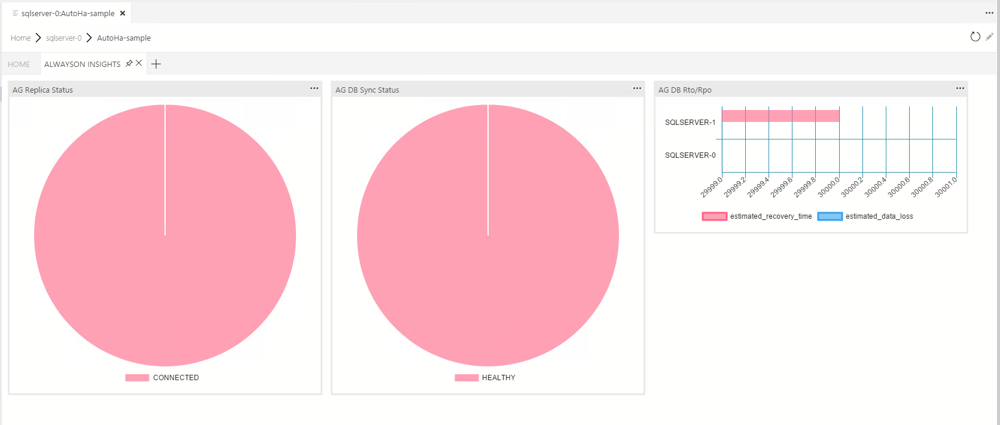

# AlwaysOn-Insights widget

This collection of widgets are designed to provide insights into AlwaysOn Availability Group components to assist DBA's or similar in managing their environment.

Where possible all of these widgets will include more detail when you click *_Show Details_* from the widget menu.


## Installation

The current release will be available through the Extensions Marketplace in Sql Ops Studio.

Current and Pre-releases will be available from the [Releases](https://github.com/Matticusau/sqlops-alwayson-insights/releases) tab of the projects repository. Simply download the VSIX of the release you want, and use the ***Install Extension from VSIX Package*** option in Sql Ops Studio.

## Supported SQL Server Versions

These widgets have been tested against the following SQL Server versions:

* SQL Server 2016
* SQL Server 2017 (Windows & linux)

If you find any issues using these widgets on these supported SQL Server versions, or any other versions please create an issue as we would like to make these available for as many releases as possible.

***We are looking for testers to confirm other environments.*** So if you find they do work on other releases let me know, and credit will be given.

## Dashboard Tab

When the extension is loaded it will add a Dashboard tab. You can edit your workspace settings in the *dashboard.server.tabs* section to include this on your specific projects.



## alwayson-ag-replica-health

This Server Dashboard widget includes information on the health of the Availability Group replicas associated with this instance. Information will be shown in the form of a pie chart displaying the percentage of CONNECTED and DISCONNECTED replicas.


> NOTE: in v0.1.0.0 this widget was called `ag-replica-health-insight`

You can access more information about the replicas in the detailed fly-out displayed when you select "..." on the widget.


To install this widget add the following json to either your user or workspace settings in the *dashboard.server.widgets* section.

```json
{
    "widget": {
        "alwayson-ag-replica-health.insight": {
            "cacheId": "1d7cba8b-c87a-4bcc-ae54-2f40a5503a90"
        }
    }
}
```

## alwayson-ag-db-sync

This Database Dashboard widget includes information on the health of the database replicas associated with the selected database. Information will be shown in the form of a pie chart displaying the percentage of HEALTHY and NOT_HEALTHY database replicas that the selected database is partnered with inside an Availability Group.


> NOTE: in v0.1.0.0 this widget was called `ag-db-sync-insight`

You can access more information about the database replicas in the detailed fly-out displayed when you select "..." on the widget.


To install this widget add the following json to either your user or workspace settings in the *dashboard.database.widgets* section.

```json
{
    "widget": {
        "alwayson-ag-db.insight": {
            "cacheId": "1d7cba8b-c87a-4bcc-ae54-2f40a5503a90"
        }
    }
}
```

## alwayson-ag-db-rpo-rto

This Database Dashboard widget includes information on the synchronization state of the avaialbility group database to the partnered replicas. The information assists in estimating the current Recovery Time Objective (RTO) through the *estimated_recovery_time* column, and the Recovery Point Objective (RPO) through the *estimated_data_loss* column. Information will be shown in the form of a bar chart displaying both fields.


> NOTE: in v0.1.0.0 this widget was called `ag-db-rpo-rto-insight`

You can access more information about the synchronization state in the detailed fly-out displayed when you select "..." on the widget.


To install this widget add the following json to either your user or workspace settings in the *dashboard.database.widgets* section.

```json
{
    "widget": {
        "alwayson-ag-db-rpo-rto.insight": {
            "cacheId": "1d7cba8b-c87a-4bcc-ae54-2f40a5503a90"
        }
    }
}
```